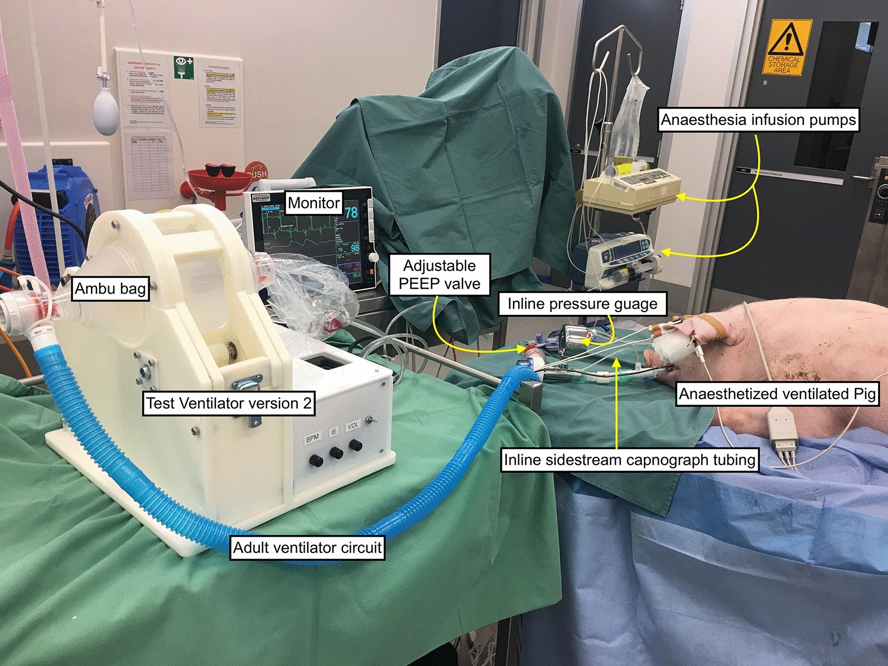
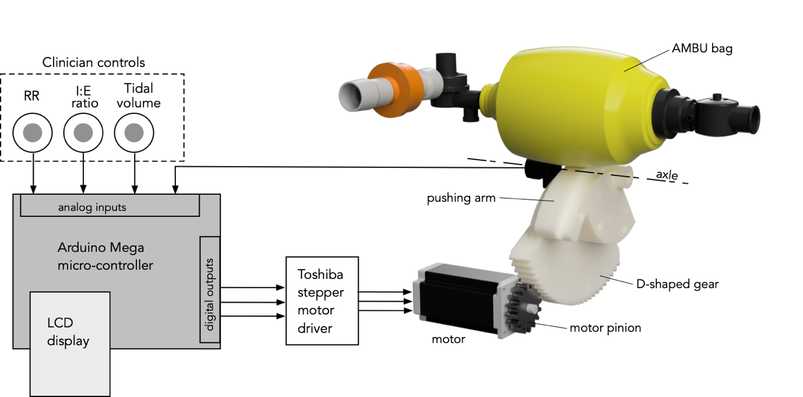
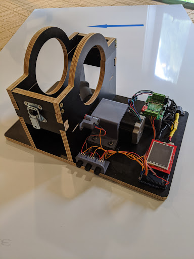
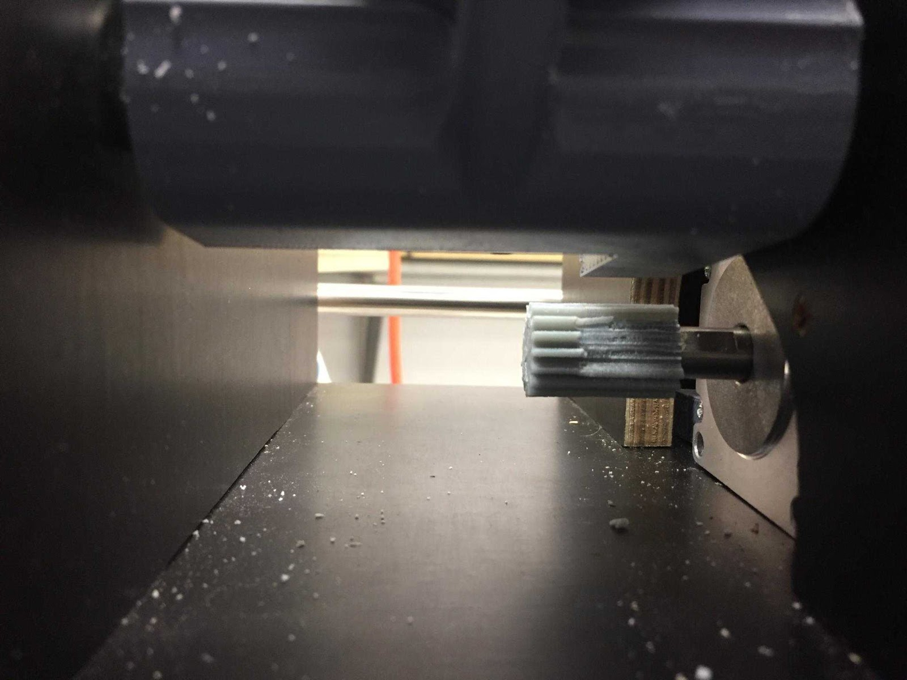
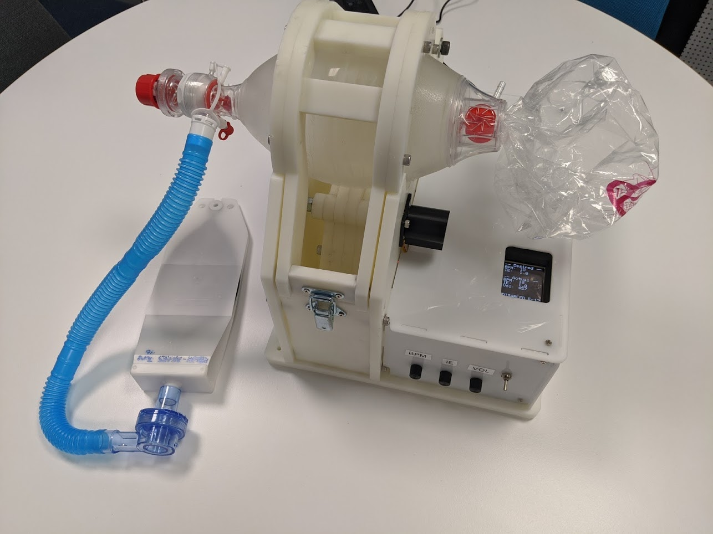
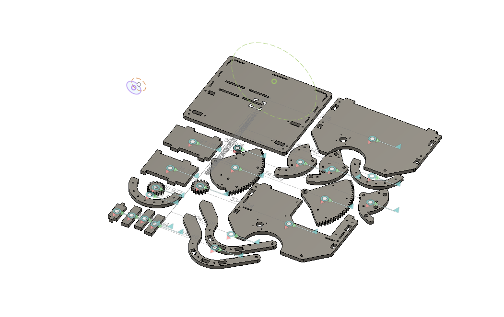
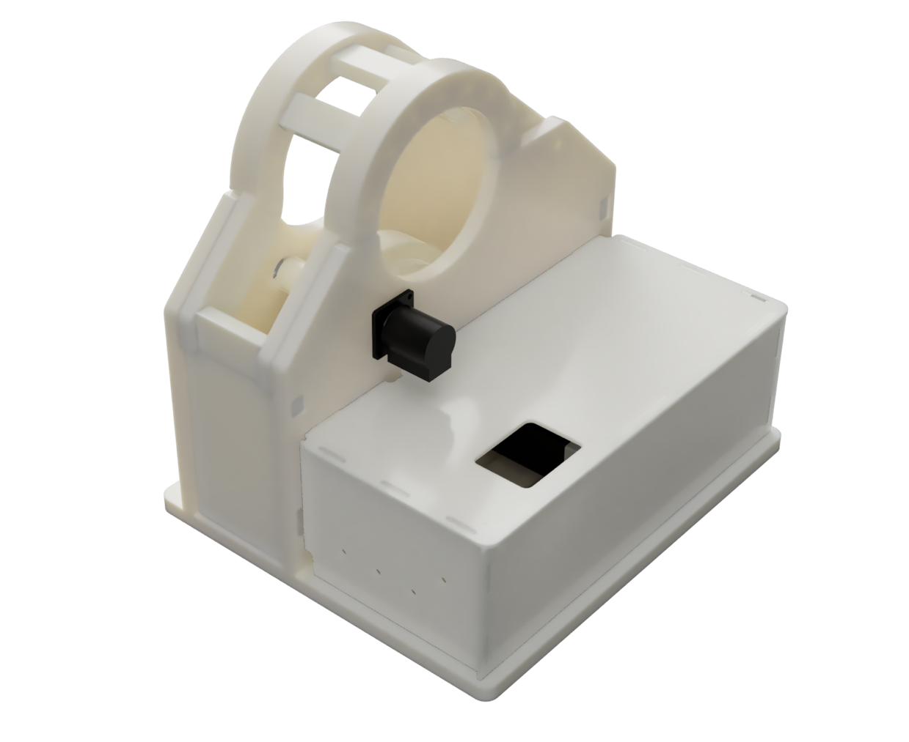

# Introduction

In response to the COVID-19 crisis the QUT Centre for Robotics, in March/April 2020, developed a simple and low-cost mechanical ventilator.
The efficacy of the ventilator was tested on live pigs [2] who showed no adverse effects compared to a standard ventilator.

During surge requirements, the time to manufacture a usable ventilator is an important feature. For wider application including in low-income countries, it is necessary to maintain the manufacturing cost at the minimum. 3D printing is also a slow fabrication process for large components whilst the rapid prototyping is a faster process. The short manufacturing time (~ 2 hours) and affordable cost (~ $AUD 300) makes the rapid prototyped ventilator a viable alternative where there are inadequate number of ventilators required to meet the demands imposed by pandemic like situations. 

The only recurrent consumable is the artificial manual breathing unit (AMBU) bag (cost) that would need to be changed every 48 hours. 

## Design aims

Our design aims were:
 * For the machine to be manufacturable quickly and cheaply with as few components as possible. Components had to be easily sourced or substituted.  Our second design can be cut from a sheet of 12mm Nylon or other engineering plastic using a water jet or CNC router. The mechanical parts can be cut in a single operation in less than 1 hour, and assembled in less than 3 hours.
 * To accommodate a wide variety of electric motors. We used a stepper mode but other types of motors could be used. Brushed DC motors, for example, are widely used for windscreen wiper motors and could be easily substituted.
 * To use low-end commodity computing hardware and sensors. We used an Arduino Mega with a simple display panel and low-cost potentiometers.
 
 
 ## Common design elements
 
 We built two versions of the ventilator, and they share basic design features as shown below (which is the Mark 2 design)
 
 
 
 
# Mark 1 ventilator

We were motivated by the work of [Al Husseini et al.](https://www.researchgate.net/publication/245374049_Design_and_Prototyping_of_a_Low-Cost_Portable_Mechanical_Ventilator) who proposed a machine to regularly compress a bag-valve mask (BVM).  This design leverages widely available commodity medical equipment while requiring only a relatively simple machine to compress the bag by a settable amount on a settable time schedule. We compress the bag by pushing it on just one side using an arm which rotates about a fixed pivot point.  The arm is driven by a computer controlled motor. This enables the machine to be very simple with just two moving parts: the motor shaft and the arm.  The motion of the arm would require the bag to slide across the surface of the arm, however the high friction of the bag's surface means that sliding does not occur but it results in increased motor torque as well as some wear and tear of the bag.  While this is not ideal, in practice the bags have lasted upto 72 hours, but show signs of wear.

We built our first machine in one week using CNC-cut plywood frame, 3D printed components, a high-power stepper motor that we had to hand, an Arduino microcontroller, an TFT display, three potentiometers to control its operation using parameters familiar to clinicians and one potentiometer for motor feedback. The machine is unashamedly bare bones and includes no instrumentation for flow or for pressure.  

In the first pig trial, at high PEEP, the motor was working hard and the PLA pinion melted.  We replaced it with an ABS pinion which subsequently 
shattered

However, the two material (PLA and ABS) failures demonstrated important limitations that were not obvious during the in vitro tests. This is important as CAD software and 3D printing is a commodity technology that puts manufacturing capability in the hands of enthusiasts who may lack knowledge of mechanical design principles (gear design) and material properties.  Poorly designed mechanical components exist on the internet and will propagate into designs leading to complications.  

# Mark 2 ventilator

The design aims were to:

* redesign the gears to ensure that tooth forces were within the material limits,
* dramatically reduce the manufacturing time

We solved both problems by building the Mark 2 machine almost entirely from Nylon (cut from 12 mm sheet using CNC router).  
While Nylon can be 3D printed, we cut the gears from 12mm sheet using a CNC router (Multicam) although waterjet cutting could also be used.  This fabrication approach allowed us to fabricate the entire machine from 12mm Nylon parts and these were be cut in a single operation, see Figure 1, in around 45 minutes.  The parts were assembled in an hour to yield the machine shown below.

The gears are each made from a stack of two 12 mm thick cut pieces, giving a gear width of 24mm compared to 18mm for the PLA gears in version 1. The increased gear width, and redesigned teeth, reduces the tooth stress.  Combined with the heat resistance and mechanical advantages of Nylon over PLA and (ABS) this resulted in a realiable and long-lasting drive system.

The cut file for the Nylon sheet is

A CAD render of the assembled Nylon components (and feedback potentiometer) is

# Control software

The software allows control of three ventilation parameters: breaths per minute (BPM), inspiration/expiration ratio (IE), and tidal (breath) volume.  We implement an inspiration hold time but this is fixed in the program and not currently adjustable by the clinician. We control the pusher arm to rotate at constant velocity during the inspiration time upto a maximum stroke which is a function of the required tidal volume.  The arm is held for a constant time, and then retracted quickly allowing the bag to reinflate by itself.

The control parameters are set by three potentiometers connected to analog inputs of the microcontroller.  They are digitized, rescaled and displayed continuously on the LCD panel. At the start of a cycle a snapshot of these parameters is made and used to compute the inspiration time, expiration time and the maximum stroke.  The controller then drives the pusher at the required speed for the required time, holds, and then retracts.

The inclusion of an inspiration hold time means that for some settings of IE and BPM the inspiration time can become negative.  The firmware detects this and displays a warning on the LCD panel.  If this condition exists at the start of the cycle those parameters are ignored and those for the previous cycle continue to be used.

The relationship between maximum rotation of the arm and supplied volume was calibrated for five points and incorporated into a lookup table in the control firmware.

An additional potentiometer on the shaft of the pusher arm provides an absolute and continuous measurement of the rotation angle of the pusher arm.  We use a stepper motor but for large volume and high PEEP we observe that the motor may lose steps so we cannot rely simply on step counting.

For safety an independent microprocessor should monitor this potentiometer output to determine whether its amplitude and frequency is within bounds.

# References
[1] Husseini, Abdul & Lee, Heon Ju & Negrete, Justin & Powelson, Stephen & Servi, Amelia & Slocum, Alexander & Saukkonen, Jussi. (2010). Design and Prototyping of a Low-Cost Portable Mechanical Ventilator. ASME Journal of Medical Devices 4(2), June 2010. DOI [10.1115/1.3442790](https://dx.doi.org/10.1115/1.3442790). 

[2] Dhanani, J., Pang, G., Pincus, J. et al. Increasing ventilator surge capacity in COVID 19 pandemic: design, manufacture and in vitro–in vivo testing in anaesthetized healthy pigs of a rapid prototyped mechanical ventilator. BMC Res Notes 13, 421 (2020). https://doi.org/10.1186/s13104-020-05259-z
